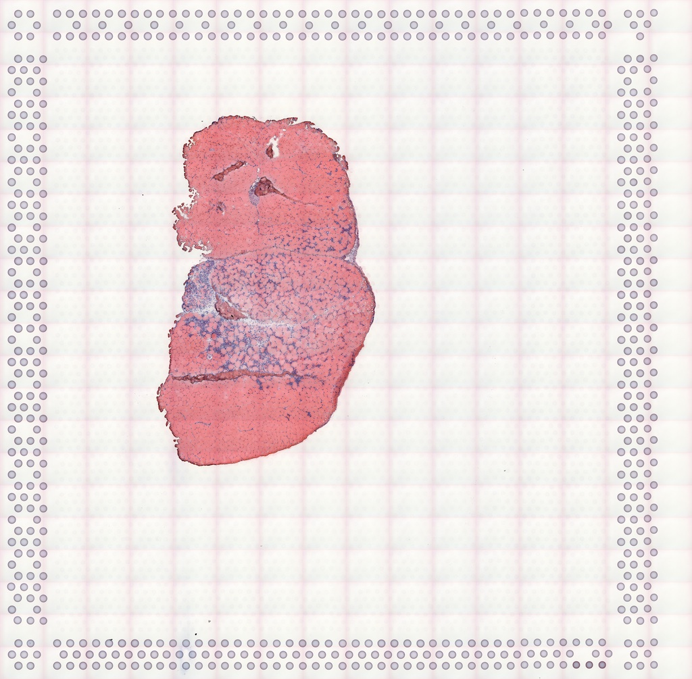

```{r, include = FALSE}
knitr::opts_chunk$set(
  collapse = TRUE,
  comment = "#>"
)
```

# Introduction
Introduction slides are available [here](https://drive.google.com/file/d/1G4wdnLCtuRU_7I0zXJ3OwyyugPuhPH28/view?usp=sharing). The rendered version of this workshop is available [here](https://lambdamoses.github.io/VoyagerWorkshop/articles/workshop.html). The following R packages are used in this workshop, which are all on CRAN or Bioconductor. Bioconductor 3.17 is used in the workshop presented at Bioc2023.
```{r, message=FALSE}
library(SpatialFeatureExperiment)
library(SingleCellExperiment)
library(Voyager)
library(SFEData)
library(scran)
library(scater)
library(ggplot2)
library(rjson)
library(Matrix)
library(sf)
library(scales)
library(patchwork)
library(BiocParallel)
library(tibble)
library(tidyr)
library(scico)
library(pheatmap)
library(BiocNeighbors)
library(BiocSingular)
library(bluster)
theme_set(theme_bw())
```

## `SpatialFeatureExperiment`
`SpatialFeatureExperiment` (SFE) is a new [S4](http://adv-r.had.co.nz/S4.html) class built on top of [`SpatialExperiment`](https://bioconductor.org/packages/release/bioc/html/SpatialExperiment.html) (SPE). SFE incorporates geometries and geometric operations with the [`sf`](https://cran.r-project.org/web/packages/sf/index.html) package. Examples of supported geometries are Visium spots represented with polygons corresponding to their size, cell or nuclei segmentation polygons, tissue boundary polygons, pathologist annotation of histological regions, and transcript spots of genes. Using `sf`, `SpatialFeatureExperiment` leverages the GEOS C++ library underlying `sf` for geometry operations, including algorithms for for determining whether geometries intersect, finding intersection geometries, buffering geometries with margins, etc. A schematic of the SFE object is shown below:

```{r, echo=FALSE, out.width = "100%",  fig.alt="SpatialFeatureExperiment expands on SpatialExperiment by adding column, row, and annotation geometries and spatial graphs. This is explained in detail in the following paragraphs."}
knitr::include_graphics("sfe_schematics.png")
```

Below is a list of SFE features that extend the SPE object:

* `colGeometries` are `sf` data frames associated with the entities that correspond to columns of the gene count matrix, such as Visium spots or cells. The geometries in the `sf` data frames can be Visium spot centroids, Visium spot polygons, or for datasets with single cell resolution, cell or nuclei segmentations. Multiple `colGeometries` can be stored in the same SFE object, such as one for cell segmentation and another for nuclei segmentation. There can be non-spatial, attribute columns in a `colGeometry` rather than `colData`, because the `sf` class allows users to specify how attributes relate to geometries, such as "constant", "aggregate", and "identity". See the `agr` argument of the [`st_sf` documentation](https://r-spatial.github.io/sf/reference/sf.html).
* `colGraphs` are spatial neighborhood graphs of cells or spots. The graphs have class `listw` (`spdep` package), and the `colPairs` of `SingleCellExperiment` was not used so no conversion is necessary to use the numerous spatial dependency functions from `spdep`, such as those for Moran's I, Geary's C, Getis-Ord Gi*, LOSH, etc. Conversion is also not needed for other classical spatial statistics packages such as `spatialreg` and `adespatial`.
* `rowGeometries` are similar to `colGeometries`, but support entities that correspond to rows of the gene count matrix, such as genes. A potential use case is to store transcript spots for each gene in smFISH or in situ sequencing based datasets.
* `rowGraphs` are similar to `colGraphs`. A potential use case may be spatial colocalization of transcripts of different genes.
* `annotGeometries` are `sf` data frames associated with the dataset but not directly with the gene count matrix, such as tissue boundaries, histological regions, cell or nuclei segmentation in Visium datasets, and etc. These geometries are stored in this object to facilitate plotting and using `sf` for operations such as to find the number of nuclei in each Visium spot and which histological regions each Visium spot intersects. Unlike `colGeometries` and `rowGeometries`, the number of rows in the `sf` data frames in `annotGeometries` is not constrained by the dimension of the gene count matrix and can be arbitrary.
* `annotGraphs` are similar to `colGraphs` and `rowGraphs`, but are for entities not directly associated with the gene count matrix, such as spatial neighborhood graphs for nuclei in Visium datasets, or other objects like myofibers. These graphs are relevant to `spdep` analyses of attributes of these geometries such as spatial autocorrelation in morphological metrics of myofibers and nuclei. With geometry operations with `sf`, these attributes and results of analyses of these attributes (e.g. spatial regions defined by the attributes) may be related back to gene expression.
* `localResults` are similar to [`reducedDims` in `SingleCellExperiment`](https://bioconductor.org/packages/release/bioc/vignettes/SingleCellExperiment/inst/doc/intro.html#3_Adding_low-dimensional_representations), but stores results from univariate and bivariate local spatial analysis results, such as from [`localmoran`](https://r-spatial.github.io/spdep/reference/localmoran.html), [Getis-Ord Gi\*](https://r-spatial.github.io/spdep/reference/localG.html), and [local spatial heteroscedasticity (LOSH)](https://r-spatial.github.io/spdep/reference/LOSH.html). Unlike in `reducedDims`, for each type of results (type is the type of analysis such as Getis-Ord Gi\*), each feature (e.g. gene) or pair of features for which the analysis is performed has its own results. The local spatial analyses can also be performed for attributes of `colGeometries` and `annotGeometries` in addition to gene expression and `colData`. Results of multivariate spatial analysis such as [MULTISPATI PCA](https://cran.r-project.org/web/packages/adespatial/vignettes/tutorial.html#multispati-analysis) can be stored in `reducedDims`.

## `Voyager`

```{r, echo=FALSE, out.width = "100%", fig.alt="Schematics of the Voyager project"}
knitr::include_graphics("voyager.png")
```

## 10X Visium
As Visium from 10X Genomics is currently the most popular spatial transcriptomics technology, this workshop uses a Visium dataset.

```{r, echo = FALSE, fig.alt='Bar chart showing the number of institutions using each spatial transcriptomics data collection method. Only methods used by at least 3 different institutions are shown. The bars are colored by category of the methods. 10X Visium which is based on sequence barcoding is used by almost 200 institutions. Following Visium are GeoMX DSP and GeoMX WTA which are "regions of interest" (ROI) methods, along with 2016 ST, MERFISH, and some other ROI selection methods.'}
knitr::include_graphics("https://pachterlab.github.io/LP_2021/04-current_files/figure-html/n-insts-1.png")
```

In Visium, capture sequences with spot barcode, unique molecule identifier (UMI), and polyT to capture poly-adenylated mRNAs are printed in a hexagonal array on a glass slide. Each spot barcode has a known location, and the spots are 55 $\mu m$ in diameter and 100 $\mu m$ apart center to center. As the spots are much larger than most types of cells, Visium does not have single cell resolution. Tissue is mounted on each of the 4 capture areas on the slide, and each capture area has 4992 spots. The spots capture the transcripts from the tissue, which are then reverse transcribed, amplified, and sequenced.

```{r, echo = FALSE, fig.alt="Intro to Visium, described in the previous paragraph"}
knitr::include_graphics("visium.png")
```

Space Ranger is the official software to align the sequencing reads to the genome and quantify the UMIs in each spot for each gene. Spatial Ranger also takes in a histology image of the capture area, with which it determines which spots are in tissue. The user can also manually determine which spots are in tissue in the Loupe Browser.

# Part 1: The SFE class
## Create an SFE object

10x Genomics Space Ranger output from a Visium experiment can be read in a similar manner as in `SpatialExperiment`; the `SpatialFeatureExperiment` SFE object has the `spotPoly` column geometry for the spot polygons. If the filtered matrix (i.e. only spots in the tissue) is read in, then a column graph called `visium` will also be present for the spatial neighborhood graph of the Visium spots on the tissue. The graph is not computed if all spots are read in regardless of whether they are on tissue.

```{r}
dir <- system.file("extdata", package = "SpatialFeatureExperiment")
sample_ids <- c("sample01", "sample02")
(samples <- file.path(dir, sample_ids))
```

The results for each tissue capture should be in the `outs` directory under the sample directory. Inside the `outs` directory, these directories may be present: `raw_reature_bc_matrix` has the unfiltered gene count matrix, `filtered_feature_bc_matrix` has the gene count matrix for spots in tissue, and `spatial` has the spatial information. The matrix directories contain the matrices in MTX format as sparse matrices. Space Ranger also outputs the matrices as h5 files, which are read into R in a similar way as MTX.

```{r}
list.files(file.path(samples[1], "outs"))
```

Inside the matrix directory:
```{r}
list.files(file.path(samples[1], "outs", "filtered_feature_bc_matrix"))
```

Inside the `spatial` directory:

```{r}
list.files(file.path(samples[1], "outs", "spatial"))
```

`tissue_lowres_image.png` is a low resolution image of the tissue. Not all Visium datasets have all the files here. The `barcode_fluorescence_intensity.csv` file is only present in datasets with fluorescent imaging rather than bright field H&E. 

```{r}
(sfe3 <- read10xVisiumSFE(samples, sample_id = sample_ids, type = "sparse", 
                          data = "filtered"))
```

Space Ranger output includes the gene count matrix, spot coordinates, and spot diameter. The Space Ranger output does NOT include nuclei segmentation or pathologist annotation of histological regions. Extra image processing, such as with ImageJ and QuPath, are required for those geometries.

See [this vignette](https://pachterlab.github.io/voyager/articles/create_sfe.html) on creating SFE objects from scratch and for other spatial trancriptomics technologies.

## Operations of SFE objects
User interfaces to get or set the geometries and spatial graphs emulate those of `reducedDims` and `row/colPairs` in `SingleCellExperiment`. Column and row geometries also emulate `reducedDims` in internal implementation, while annotation geometries and spatial graphs differ. Operations on SFE objects are demonstrated on a small toy dataset (you may need to answer a prompt in the R console when downloading the dataset):
```{r}
(sfe <- McKellarMuscleData(dataset = "small"))
```

### Column geometries
Column geometries or `colGeometries` are the geometries that correspond to columns of the gene count matrix, such as Visium spots and cells in datasets from a single cell resolution technology. Each SFE object can have multiple column geometries. For example, in a dataset with single cell resolution, whole cell segmentation and nuclei segmentation are two different `colGeometries`. However, for Visium, the spot polygons are the only `colGeometry` obviously relevant, though users can add other geometries such as results of geometric operations on the spot polygons. The different geometries can be get or set with their names, and "spotPoly" is the standard name for Visium spot polygons.
```{r}
# Get Visium spot polygons
(spots <- colGeometry(sfe, "spotPoly"))
```

```{r}
plot(st_geometry(spots))
```

```{r}
# Set colGeometry
colGeometry(sfe, "spotPoly") <- spots
```

To see which `colGeometries` are present in the SFE object:
```{r}
colGeometryNames(sfe)
```

There are shorthands for some specific column or row geometries. For example, `spotPoly(sfe)` is equivalent to `colGeometry(sfe, "spotPoly")` shown above. 

```{r}
# Getter
(spots <- spotPoly(sfe))
```

```{r}
# Setter
spotPoly(sfe) <- spots
```

### Annotation
Annotation geometries can be get or set with `annotGeometry()`. In column or row geometries, the number of rows of the `sf` data frame (i.e. the number of geometries in the data frame) is constrained by the number of rows or columns of the gene count matrix respectively, because just like `rowData` and `colData`, each row of a `rowGeometry` or `colGeometry` `sf` data frame must correspond to a row or column of the gene count matrix respectively. In contrast, an `annotGeometry` `sf` data frame can have any dimension, not constrained by the dimension of the gene count matrix. 

```{r}
# Getter, by name or index
(tb <- annotGeometry(sfe, "tissueBoundary"))
```

```{r}
plot(st_geometry(tb))
```

```{r}
# Setter, by name or index
annotGeometry(sfe, "tissueBoundary") <- tb
```

See which `annotGeometries` are present in the SFE object:
```{r}
annotGeometryNames(sfe)
```

There are shorthands for specific annotation geometries. For example, `tissueBoundary(sfe)` is equivalent to `annotGeometry(sfe, "tissueBoundary")`. `cellSeg()` (cell segmentation) and `nucSeg()` (nuclei segmentation) would first query `colGeometries` (for single cell, single molecule technologies, equivalent to `colGeometry(sfe, "cellSeg")` or `colGeometry(sfe, "nucSeg")`), and if not found, they will query `annotGeometries` (for array capture and microdissection technologies, equivalent to `annotGeometry(sfe, "cellSeg")` or `annotGeometry(sfe, "nucSeg")`). 

```{r}
# Getter
(tb <- tissueBoundary(sfe))
```

```{r}
# Setter
tissueBoundary(sfe) <- tb
```

### Spatial graphs
The spatial neighborhood graphs for Visium spots are stored in the `colGraphs` field, which has similar user interface as `colGeometries`. SFE also wraps all methods to find the spatial neighborhood graph implemented in the `spdep` package, and triangulation is used here as demonstration.
```{r}
(g <- findSpatialNeighbors(sfe, MARGIN = 2, method = "tri2nb"))
```

```{r}
plot(g, coords = spatialCoords(sfe))
```

```{r}
# Set graph by name
colGraph(sfe, "graph1") <- g
```

```{r}
# Get graph by name
(g <- colGraph(sfe, "graph1"))
```

For Visium, spatial neighborhood graph of the hexagonal grid can be found with the known locations of the barcodes. One SFE object can have multiple `colGraphs`.
```{r}
colGraph(sfe, "visium") <- findVisiumGraph(sfe)
```

```{r}
plot(colGraph(sfe, "visium"), coords = spatialCoords(sfe))
```

Which graphs are present in this SFE object?
```{r}
colGraphNames(sfe)
```

While this workshop only works with one sample, i.e. tissue section, operations on multiple samples is discussed in [the vignette of the SFE package](https://pachterlab.github.io/SpatialFeatureExperiment/articles/SFE.html#multiple-samples).

# Part 2: Voyager ESDA

## Dataset
The dataset used in this vignette is from the paper [Large-scale integration of single-cell transcriptomic data captures transitional progenitor states in mouse skeletal muscle regeneration](https://doi.org/10.1038/s42003-021-02810-x) [@McKellar2021-ek]. Notexin was injected into the tibialis anterior muscle of mice to induce injury, and the healing muscle was collected 2, 5, and 7 days post injury for Visium analysis. The dataset in this vignette is from the timepoint at day 2. The vignette starts with a `SpatialFeatureExperiment` (SFE) object.

The gene count matrix was directly downloaded [from GEO](https://www.ncbi.nlm.nih.gov/geo/query/acc.cgi?acc=GSM4904759). All 4992 spots, whether in tissue or not, are included. The H&E image was used for nuclei and myofiber segmentation. A subset of nuclei from randomly selected regions from all 3 timepoints were manually annotated to train a StarDist model to segment the rest of the nuclei, and the myofibers were all manually segmented. The tissue boundary was found by thresholding in OpenCV, and small polygons were removed as they are likely to be debris. Spot polygons were constructed with the spot centroid coordinates and diameter in the Space Ranger output. The `in_tissue` column in `colData` indicates which spot polygons intersect the tissue polygons, and is based on `st_intersects()`.

Tissue boundary, nuclei, myofiber, and Visium spot polygons are stored as `sf` data frames in the SFE object. See [the vignette of `SpatialFeatureExperiment`](https://bioconductor.org/packages/devel/bioc/vignettes/SpatialFeatureExperiment/inst/doc/SFE.html) for more details on the structure of the SFE object. The SFE object of this dataset is provided in the `SFEData` package; we begin by downloading the data and loading it into R.

```{r}
(sfe <- McKellarMuscleData("full"))
```

The H&E image of this section:
```{r, echo = FALSE, fig.alt="A cross section of mouse muscle is slightly off center to the lower left. In the middle of the tissue is the notexin injury site with leukocyte infiltration and fewer myofibers. The rest of the tissue section is tightly packed with myofibers."}

```

The image can be added to the SFE object and plotted behind the geometries, and needs to be flipped to align to the spots because the origin is at the top left for the image but bottom left for geometries.
```{r}
sfe <- addImg(sfe, file = "tissue_lowres_5a.jpeg", sample_id = "Vis5A", 
              image_id = "lowres", 
              scale_fct = 1024/22208)
sfe <- mirrorImg(sfe, sample_id = "Vis5A", image_id = "lowres")
```

## Exploratory data analysis
### Spots in tissue
While the example dataset has all Visium spots whether on tissue or not, only spots that intersect tissue are used for further analyses. 

```{r}
names(colData(sfe))
```

Total UMI counts (`nCounts`), number of genes detected per spot (`nGenes`), and the proportion of mitochondrially encoded counts (`prop_mito`) have been precomputed and are in `colData(sfe)`. The `plotSpatialFeature()` function can be used to visualize various attributes in space: the expression of any gene, `colData` values, and geometry attributes in `colGeometry` and `annotGeometry`. The Visium spots are plotted as polygons reflecting their actual size relative to the tissue, rather than as points, as is the case in other packages that plot Visium data. The plotting of geometries is being performed under the hood with `geom_sf`.

The tissue boundary was found by thresholding the H&E image and removing small polygons that are most likely debris. The `in_tissue` column of `colData(sfe)` indicates which Visium spot polygon intersects the tissue polygon; this can be found with `SpatialFeatureExperiment::annotPred()`.

We demonstrate the use of `scran` [@Lun2016-yq] for normalization below, although we note that it is not necessarily the best approach to normalizing spatial transcriptomics data. The problem of when and how to normalize spatial transcriptomics data is non-trivial because, as the `nCounts` plot in space shows above, spatial autocorrelation is evident. Furthermore, in Visium, reverse transcription occurs in situ on the spots, but PCR amplification occurs after the cDNA is dissociated from the spots. Artifacts may be subsequently introduced from the amplification step, and these would not be associated with spatial origin. Spatial artifacts may arise from the diffusion of transcripts and tissue permeablization. However, given how the total counts seem to correspond to histological regions, the total counts may have a biological component and hence should not be treated as a technical artifact to be normalized away as in scRNA-seq data normalization methods. In other words, the issue of normalization for spatial transcriptomics data, and Visium in particular, is complex and is currently unsolved. 
```{r}
sfe_tissue <- sfe[,colData(sfe)$in_tissue]
sfe_tissue <- sfe_tissue[rowSums(counts(sfe_tissue)) > 0,]
```

```{r}
#clusters <- quickCluster(sfe_tissue)
#sfe_tissue <- computeSumFactors(sfe_tissue, clusters=clusters)
#sfe_tissue <- sfe_tissue[, sizeFactors(sfe_tissue) > 0]
sfe_tissue <- logNormCounts(sfe_tissue)
```

Myofiber and nuclei segmentation polygons are available in this dataset in the `annotGeometries` field. Myofibers were manually segmented, and nuclei were segmented with [`StarDist`](https://github.com/stardist/stardist) trained with a manually segmented subset. 

```{r}
annotGeometryNames(sfe_tissue)
```

#### From myofibers and nuclei to Visium spots
The `plotSpatialFeature()` function can also be used to plot attributes of geometries, i.e. the non-geometry columns in the `sf` data frames in the `rowGeometries`, `colGeometries`, or `annotGeometries` fields of the SFE object. 

The myofiber polygons from `annotGeometries` can be plotted as shown below, colored by cross section area as observed in the tissue section. The `aes_use` argument is set to `color` rather than `fill` (default for polygons) to only plot the Visium spot outlines to make the myofiber polygons more visible. The `fill` argument is set to `NA` to make the Visium spots look hollow, and the `size` argument controls the thickness of the outlines. The `annot_aes` argument specifies which column in the `annotGeometry` to use to specify the values of an aesthstic, just like `aes` in `ggplot2` (`aes_string` to be precise, since `tidyeval` is not used here). The `annot_fixed` argument (not used here) can set the fixed size, alpha, color, and etc. for the `annotGeometry`. 
```{r, fig.alt="Plot of Visium spots in tissue and myofiber polygons in physical space. Visium spots are colored by nCounts, and myofibers are colored by area."}
plotSpatialFeature(sfe_tissue, features = "nCounts", 
                   colGeometryName = "spotPoly",
                   annotGeometryName = "myofiber_simplified", 
                   aes_use = "color", linewidth = 0.5, fill = NA,
                   annot_aes = list(fill = "area"))
```

The larger myofibers seem to have fewer total counts, possibly because the larger size of these myofibers dilutes the transcripts. This hints at the need for a normalization procedure.

With `SpatialFeatureExperiment`, we can find the number of myofibers and nuclei that intersect each Visium spot. The predicate can be [anything implemented in `sf`](https://r-spatial.github.io/sf/reference/geos_binary_pred.html), so for example, the number of nuclei fully covered by each Visium spot can also be found. The default predicate is `st_intersects()`.
```{r}
colData(sfe_tissue)$n_myofibers <- 
  annotNPred(sfe_tissue, colGeometryName = "spotPoly",
             annotGeometryName = "myofiber_simplified")
```

```{r, fig.alt="Plot of Visium spots in tissue in physical space, colored by number of myofibers intersecting each spot."}
plotSpatialFeature(sfe_tissue, features = "n_myofibers", 
                   colGeometryName = "spotPoly", image = "lowres", color = "black",
                   linewidth = 0.1)
```

There is no one-to-one mapping between Visium spots and myofibers. However, we can relate attributes of myofibers to gene expression detected at the Visium spots. One way to do so is to summarize the attributes of all myofibers that intersect (or choose another better predicate implemented in `sf`) each spot, such as to calculate the mean, median, or sum. This can be done with the `annotSummary()` function in `SpatialFeatureExperiment`. The default predicate is `st_intersects()`, and the default summary function is `mean()`.
```{r}
colData(sfe_tissue)$mean_myofiber_area <- 
  annotSummary(sfe_tissue, "spotPoly", "myofiber_simplified", 
               annotColNames = "area")[,1] # it always returns a data frame
```

```{r, fig.alt="Plot of Visium spots in tissue in physical space, colored by the average area of myofibers that intersect each spot. The average area is higher near the mid-top right part of the tissue."}
# The gray spots don't intersect any myofiber
plotSpatialFeature(sfe_tissue, "mean_myofiber_area", "spotPoly", image = "lowres", 
                   color = "black", linewidth = 0.1)
```

This reveals the relationship between the mean area of myofibers intersecting each Visium spot and other aspects of the spots, such as total counts and gene expression.

The NAs (gray) designate spots not intersecting any myofibers, e.g. those in the inflammatory region. 

The nGenes vs. nCounts plot is a standard QC plot in scRNA-seq, but here we see two mysterious branches and two clusters in the nGenes vs. nCounts plot and the proportion of mitochondrial counts vs. nCounts plot. The two branches or clusters seem to be related to myofiber size.
```{r}
plotColData(sfe_tissue, x = "nCounts", y = "nGenes", colour_by = "mean_myofiber_area")
```

```{r}
plotColData(sfe_tissue, x = "nCounts", y = "prop_mito", colour_by = "mean_myofiber_area")
```

##### Exercises
1. Use the `annotNPred()` function to find the number of nuclei intersecting each Visium spot. The nuclei segmentation polygons are in the `annotGeometry` called "nuclei".
2. Color the Visium spots with the number of nuclei. Which histological region tends to have more nuclei per Visium spot?
3. Does the number of nuclei per spot correlate with nCounts?

#### Plot gene expression in space
Marker genes: Myh7 (Type I, slow twitch, aerobic), Myh2 (Type IIa, fast twitch, somewhat aerobic), Myh4 (Type IIb, fast twitch, anareobic), Myh1 (Type IIx, fast twitch, anaerobic), from [this protocol](https://www.ncbi.nlm.nih.gov/pmc/articles/PMC5526362/) [@Wang2017-li]
```{r}
markers <- c(I = "Myh7", IIa = "Myh2", IIb = "Myh4", IIx = "Myh1")
```

We first examine the Type I myofibers. This is a fast twitch muscle, so we don't expect many slow twitch Type I myofibers. Row names in `sfe_tissue` are Ensembl IDs in order to avoid ambiguity as sometimes multiple Ensembl IDs have the same gene symbol and some genes have aliases. However, gene symbols are shorter and more human readable than Ensembl IDs, and are better suited to display on plots.  In the `plotSpatialFeature()` function and other functions in `Voyager`, even when the row names are recorded as Ensembl IDs, the `features` argument can take gene symbols if when a column in `rowData(sfe)` that has the gene symbols are supplied in the `swap_rownames` argument. All function in `Voyager` that queries genes has the `swap_rownames` argument.

```{r}
plotSpatialFeature(sfe_tissue, "Myh2", "spotPoly",
                   annotGeometryName = "myofiber_simplified", 
                   annot_aes = list(fill = "area"), swap_rownames = "symbol", 
                   exprs_values = "logcounts", aes_use = "color", linewidth = 0.5,
                   fill = NA)
```

##### Exercises
1. The `exprs_values` argument specifies the assay to use, which is by default "logcounts", i.e. the log normalized data. This default may or may not be suitable in practice given that total UMI counts may have biological relevance in spatial data. Plot one of the marker genes above, but with the "counts" assay.
2. Look up the documentation of `plotSpatialFeature()`. Try plotting the Visium spots as filled circles that are partially transparent.

## Spatial neighborhood graphs
A spatial neighborhood graph is required to compute spatial dependency metrics such as Moran's I and Geary's C. The `SpatialFeatureExperiment` package wraps methods in `spdep` to find spatial neighborhood graphs, which are stored within the SFE object (see `spdep` documentation for `gabrielneigh()`, `knearneigh()`, `poly2nb()`, and `tri2nb()`). The `Voyager` package then uses these graphs for spatial dependency analyses, again based on `spdep` in this first version, but methods from other geospatial packages, some of which also use the spatial neighborhood graphs, may be added later.

For Visium, where the spots are in a hexagonal grid, the spatial neighborhood graph is straightforward. However, for spatial technologies with single cell resolution, e.g. MERFISH, different methods can be used to find the spatial neighborhood graph. In this example, the method "poly2nb" was used for myofibers, and it identifies myofiber polygons that physically touch each other. `zero.policy = TRUE` will allow for singletons, i.e. nodes without neighbors in the graph; in the inflamed region, there are more singletons. We have not yet benchmarked spatial neighborhood construction methods to determine which is the "best" for different technologies; the particular method used here is for demonstration purposes and may not be the best in practice: 

```{r}
colGraph(sfe_tissue, "visium") <- findVisiumGraph(sfe_tissue)
annotGraph(sfe_tissue, "myofiber_poly2nb") <- 
  findSpatialNeighbors(sfe_tissue, type = "myofiber_simplified", MARGIN = 3,
                       method = "poly2nb", zero.policy = TRUE)
```

The `plotColGraph()` function plots the graph in space associated with a `colGeometry`, along with the geometry of interest.
```{r, fig.alt="Spatial neighborhood graph of Visium spots that intersect tissue."}
plotColGraph(sfe_tissue, colGraphName = "visium", colGeometryName = "spotPoly") +
    theme_void()
```

Similarly, the `plotAnnotGraph()` function plots the graph associated with an `annotGeometry`, along with the geometry of interest. 
```{r, fig.alt="Spatial neighborhood graph of myofibers, where each edge connects two myofibers that touch."}
plotAnnotGraph(sfe_tissue, annotGraphName = "myofiber_poly2nb", 
               annotGeometryName = "myofiber_simplified") + theme_void()
```

There is no `plotRowGraph` yet since we haven't worked with a dataset where spatial graphs related to genes are relevant, although the SFE object supports row graphs.

## Exploratory _spatial_ data analysis
All spatial autocorrelation metrics in this package can be computed directly on a vector or a matrix rather than an SFE object. The user interface emulates those of dimension reductions in the `scater` package (e.g. `calculateUMAP()` that takes in a matrix or SCE object and returns a matrix, and `runUMAP()` that takes in an SCE object and adds the results to the `reducedDims` field of the SCE object). So `calculate*` functions take in a matrix or an SFE object and directly return the results (format of the results depends on the structure of the results), while `run*` functions take in an SFE object and add the results to the object. In addition, `colData*` functions compute the metrics for numeric variables in `colData`. `colGeometry*` functions compute the metrics for numeric columns in a `colGeometry`. `annotGeometry*` functions compute the metrics for numeric columns in a `annotGeometry`. 

## Univariate global
`Voyager` supports many univariate global spatial autocorrelation implemented in `spdep` for ESDA: Moran's I and Geary's C, permutation testing for Moran's I and Geary's C, Moran plot, and correlograms. In addition, beyond `spdep`, `Voyager` can cluster Moran plots and correlograms. Plotting functions taking in SFE objects are implemented to plot the results with `ggplot2` and with more customization options than `spdep` plotting functions. The functions `calculateUnivariate()` (can take data outside SFE objects), `runUnivariate()` (for gene expression), `colDataUnivariate()`, `colGeometryUnivariate()`, `annotGeometryUnivariate()`, and `reducedDimUnivariate()` compute univariate spatial statistics for different fields of the SFE object, and they all have the same arguments except for arguments specific to the field of the SFE object. The argument `type`, which indicates the corresponding function names in `spdep`, determines which spatial statistics are computed. 

All univariate global methods in `Voyager` are listed here:
```{r}
listSFEMethods(variate = "uni", scope = "global")
```

When calling `calculate*variate()` or `run*variate()`, the `type` (2nd) argument takes a string that matches an entry in the `name` column in the data frame returned by `listSFEMethods()`.

To demonstrate spatial autocorrelation in gene expression, top highly variable genes (HVGs) are used. The HVGs are found with the `scran` method.
```{r}
dec <- modelGeneVar(sfe_tissue)
hvgs <- getTopHVGs(dec, n = 50)
```

A global statistic yields one result for the entire dataset.

### Moran's I
There are several ways to quantify spatial autocorrelation, the most common of which is Moran's I [@Moran1950-aq]:

$$
I = \frac{n}{\sum_{i=1}^n \sum_{j=1}^n w_{ij}} \frac{\sum_{i=1}^n \sum_{j=1}^n w_{ij} (x_i - \bar{x})(x_j - \bar{x})}{\sum_{i=1}^n (x_i - \bar{x})^2},
$$

where $n$ is the number of spots or locations, $i$ and $j$ are different locations, or spots in the Visium context, $x$ is a variable with values at each location, and $w_{ij}$ is a spatial weight, which can be inversely proportional to distance between spots or an indicator of whether two spots are neighbors, subject to various definitions of neighborhood and whether to normalize the number of neighbors. The [`spdep`](https://r-spatial.github.io/spdep/index.html) package uses the neighborhood. 

Moran's I is analogous to the Pearson correlation between the value at each location and the average value at its neighbors (but not identical, see [@Lee2001-tm]). Just like Pearson correlation, Moran's I is generally bound between -1 and 1, where positive value indicates positive spatial autocorrelation, i.e. nearby values tend to be more similar, and negative value indicates negative spatial autocorrelation, i.e. nearby values tend to be more dissimilar. 

Upon visual inspection, total UMI counts per spot (nCounts) seem to have spatial autocorrelation. A spatial neighborhood graph is required to compute Moran's I, and is specified with the `listw` argument. 

For numeric columns of `colData(sfe)`, all univariate methods can be called with `colDataUnivariate()`. Here we compute Moran's I for nCounts and nGenes:
```{r}
sfe_tissue <- colDataUnivariate(sfe_tissue, type = "moran", 
                                features = c("nCounts", "nGenes"),
                                colGraphName = "visium")
colFeatureData(sfe_tissue)[c("nCounts", "nGenes"),]
```

For `colData`, the results are added to `colFeatureData(sfe)`, and features for which Moran's I is not calculated have NA. The column names of `featureData` distinguishes between different samples (there's only one sample in this dataset), and are parsed by plotting functions. Here the first column is the Moran's I value, which indicates moderate positive spatial autocorrelation for both nCounts and nGenes. The second column is kurtosis of the data.

Compute Moran's I for attributes of geometries: Here "area" is the area of the cross section of each myofiber as seen in this tissue section and "eccentricity" is the eccentricity of the ellipse fitted to each myofiber.
```{r}
# Remember zero.policy = TRUE since there're singletons
sfe_tissue <- annotGeometryUnivariate(sfe_tissue, type = "moran",
                                      features = c("area", "eccentricity"), 
                                      annotGeometryName = "myofiber_simplified",
                                      annotGraphName = "myofiber_poly2nb", 
                                      zero.policy = TRUE)
attr(annotGeometry(sfe_tissue, "myofiber_simplified"), "featureData")[c("area", "eccentricity"),]
```

For a non-geometry column in a `colGeometry`, `colGeometryUnivariate()` is like `annotGeometryUnivariate()` here, but none of the `colGeometries` in this dataset has extra columns.

For gene expression, the `logcounts` assay is used by default (use the `exprs_values` argument to change the assay), though this may or may not be best practice. If the metrics are computed for a large number of features, parallel computing is supported, with [`BiocParallel`](https://bioconductor.org/packages/release/bioc/html/BiocParallel.html), with the `BPPARAM` argument.
```{r}
sfe_tissue <- runUnivariate(sfe_tissue, type = "moran", features = hvgs, 
                            colGraphName = "visium")
rowData(sfe_tissue)[head(hvgs),c("moran_Vis5A", "K_Vis5A", "symbol")]
```

As Moran's I is very commonly used, `runMoransI(sfe_tissue, features = hvgs)` is equivalent to `runUnivariate(sfe_tissue, type = "moran", features = hvgs)`.

### Exercises
1. Use `listSFEMethods()` to find the "name" of Geary's C [@Geary1954-fq]. This name should be used in the `type` argument in `runUnivariate()`.
2. Compute Geary's C on the highly variable genes, and show the results. Interpretation of Geary's C: a value below 1 indicates positive spatial autocorrelation, while a value above 1 indicates negative spatial autocorrelation.

### Further reading
1. Spatial transcriptomics data is usually much larger than the typical geospatial dataset back in the 1950s when Moran's I and Geary's C were devised. See [@uo2019-dk] for asymptotic properties of Moran's I for large datasets with normal and skewed distributions.
2. The negative binomial distribution is often used to model transcriptomics data due to bursts in transcription, although the Poisson distribution is sometimes used instead to simplify the math. See [@Griffith2006-kx] for a consideration of the Poisson distribution in spatial analyses.
3. Moran's I is not exactly the same as Pearson correlation. The bounds of Moran's I depend on the spatial neighborhood graph. Usually the upper bound is around 1, while the lower bound is closer to -0.5 than -1. See [@e_Jong1984-br] for a derivation of extreme values of Moran's I and Geary's C.
4. Spatial autocorrelation decays at different length scales for different features, and the correlogram is one way to find the length scales. [These are the vignettes](https://pachterlab.github.io/voyager/articles/correlogram_landing.html) that use correlograms. Also see [this vignette](https://pachterlab.github.io/voyager/articles/vig6_merfish.html) on Moran's I flipping signs at different length scales.

## Univariate local
Local statistics yield a result at each location rather than the whole dataset, while global statistics may obscure local heterogeneity. See [@Fotheringham2009-ak] for an interesting discussion of relationships between global and local spatial statistics. Local statistics are stored in the `localResults` field of the SFE object, which can be accessed by the `localResult()` or `localResults()` functions in the `SpatialFeatureExperiment` package.

All univariate local methods in `Voyager` are listed here:
```{r}
listSFEMethods(variate = "uni", scope = "local")
```

### Local Moran's I
To recap, global Moran's I is defined as

$$
I = \frac{n}{\sum_{i=1}^n \sum_{j=1}^n w_{ij}} \frac{\sum_{i=1}^n \sum_{j=1}^n w_{ij} (x_i - \bar{x})(x_j - \bar{x})}{\sum_{i=1}^n (x_i - \bar{x})^2}.
$$

Local Moran's I [@Anselin1995-cs] is defined as

$$
I_i = (n-1)\frac{(x_i - \bar{x})\sum_{j=1}^n w_{ij} (x_j - \bar{x})}{\sum_{i=1}^n (x_i - \bar{x})^2}.
$$

It's similar to global Moran's I, but the values at locations $i$ are not summed and there's no normalization by the sum of spatial weights. Local Moran's I has been used in spatial transcriptomics in the MERINGUE package [@Miller2021-zs]. Here we compute local Moran's I for the gene Myh2.

```{r}
sfe_tissue <- runUnivariate(sfe_tissue, type = "localmoran", features = "Myh2",
                            colGraphName = "visium", swap_rownames = "symbol")
```

It is useful to plot the log normalized Myh2 gene expression as context to interpret the local results:
```{r}
plotSpatialFeature(sfe_tissue, features = "Myh2", colGeometryName = "spotPoly",
                   swap_rownames = "symbol", image_id = "lowres", color = "black",
                   linewidth = 0.1)
```

Any local spatial results can be plotted with `plotLocalResults()`, which is similar to `plotSpatialFeature()`. Here a divergent palette is used because Moran's I has a sensible center at 0 (actually the expected value of Moran's I is -1/(n-1) when the mean is unknown, but it's very close to 0 as n is typically large in spatial -omics).
```{r}
plotLocalResult(sfe_tissue, "localmoran", features = "Myh2", 
                colGeometryName = "spotPoly", divergent = TRUE,
                diverge_center = 0, image_id = "lowres", 
                swap_rownames = "symbol", color = "black",
                linewidth = 0.1)
```

We see that myofiber regions with higher Myh2 expression also have stronger spatial autocorrelation, while the injury site locally has some negative spatial autocorrelation.

The results are stored in the `localResults` field in the SFE object, with getters and setters analogous to `reducedDims`, but the name of the local method and the feature/gene for which the local method was run need to be specified as well.

```{r}
(lr <- localResults(sfe_tissue, name = "localmoran", features = "Myh2", 
                    swap_rownames = "symbol"))
```

It is interesting to see how spatial autocorrelation relates to gene expression level, much as finding how variance relates to mean in the expression of each gene, which usually indicates overdispersion compared to Poisson in scRNA-seq and Visium data:

```{r}
df <- data.frame(myh2 = logcounts(sfe_tissue)[rowData(sfe_tissue)$symbol == "Myh2",],
                 Ii = localResult(sfe_tissue, "localmoran", "Myh2", 
                                  swap_rownames = "symbol")[,"Ii"])
ggplot(df, aes(myh2, Ii)) + geom_point(alpha = 0.3) +
    geom_vline(xintercept = mean(df$myh2), linetype = 2, color = "gray") +
    geom_hline(yintercept = 0, linetype = 2, color = "gray") +
    labs(x = "Myh2 (log counts)", y = "localmoran")
```

For this gene, Visium spots with higher expression also tend to have higher local Moran's I, but this may or may not apply to other genes. The vertical dashed line marks the mean gene expression; note the subtraction of mean in the expression for global and local Moran's I, leading spots close to mean to have local Moran's I close to 0.

Local spatial analyses often return a matrix or data frame. The `plotLocalResult()` function has a default column for each local spatial method, but other columns can be plotted as well. Use the `localResultAttrs()` function to see which columns are present, and use the `attribute` argument to specify which column to plot.
```{r}
localResultAttrs(sfe_tissue, "localmoran", "Myh2", swap_rownames = "symbol")
```

Some local spatial methods return p-values at each location, in a column with name like `Pr(z != E(Ii))`, where the test is two sided (default, can be changed with the `alternative` argument in `runUnivariate()` which is passed to the relevant underlying function in `spdep`). Negative log of the p-value is computed to facilitate visualization (smaller or more significant p-values are plotted as higher values), and the p-value is corrected for multiple hypothesis testing with `p.adjustSP()` in `spdep`, where the number of tests is the number of neighbors of each location rather than the total number of locations (`-log10p_adj`).

```{r}
plotLocalResult(sfe_tissue, "localmoran", features = "Myh2", 
                colGeometryName = "spotPoly", attribute = "-log10p_adj", divergent = TRUE,
                diverge_center = -log10(0.05), swap_rownames = "symbol",
                image_id = "lowres", color = "black",
                linewidth = 0.1)
```

In this plot and all following plots of p-values, a divergent palette is used to show locations that are significant after adjusting for multiple testing and those that are not significant in different colors. The center of the divergent palette is p = 0.05, so the brown spots are significant while a dark blue means _really_ not significant.

The "pysal" column shows the type of neighborhood, such as whether low value is near other low values, or high value is near other high values.
```{r}
plotLocalResult(sfe_tissue, "localmoran", features = "Myh2", 
                colGeometryName = "spotPoly", attribute = "pysal", 
                swap_rownames = "symbol", image_id = "lowres", color = "black",
                linewidth = 0.1)
```

### Exercises
1. Compute local spatial heteroscedasticity (LOSH) [@Ord2012-qi] on Myh2 and plot the results. A sequential palette is appropriate.
2. Which other columns are returned by LOSH? Plot one of them in space. See documentation of `spdep::LOSH()` for the meanings of the other columns.
3. How does the spatial pattern of LOSH compare to that of local Moran for the same genes?

### Further reading
1. Getis-Ord Gi\* [@Ord1995-we] is another commonly used local spatial statistic which identifies hotspots (high values clustered together in space) and coldspots (low values clostered in space). [These vignettes](https://pachterlab.github.io/voyager/articles/getisord_landing.html) use Getis-Ord Gi\*.
2. The Moran scatter plot [@Anselin1996-mo] is another ESDA tool. `Voyager` has a special function to plot the results `moranPlot()`. See [these vignettes](https://pachterlab.github.io/voyager/articles/moranplot_landing.html) for examples of Moran scatter plot applied to spatial transcriptomics.
3. Analogous to the Moran scatter plot is the Geary scatter plot (not yet implemented in `Voyager`) proposed in [@Griffith2022-lk] which is said to better detect local negative spatial autocorrelation. This paper also includes other considerations on Moran's I and Geary's C.

## Bivariate
Some spatial methods analyze how two variables relate. A list of all bivariate global methods can be seen here:
```{r}
listSFEMethods(variate = "bi", scope = "global")
```

There are also local bivariate methods:
```{r}
listSFEMethods(variate = "bi", scope = "local")
```

### Lee's L
Lee's L [@Lee2001-tm] was developed from relating Moran's I to Pearson correlation, and is defined as

$$
L_{X,Y} = \frac{n}{\sum_{i=1}^n \sum_{j=1}^n w_{ij}} \frac{\sum_{i=1}^n \left[ \sum_{j=1}^n w_{ij}  (x_j - \bar{x}) \right] \left[ \sum_{j=1}^n w_{ij} (y_j - \bar{y}) \right]}{\sqrt{\sum_{i=1}^n (x_i - \bar{x})^2}\sqrt{\sum_{i=1}^n (y_i - \bar{y})^2} },
$$

where $n$ is the number of spots or locations, $i$ and $j$ are different locations, or spots in the Visium context, $x$ and $y$ are variables with values at each location, and $w_{ij}$ is a spatial weight, which can be inversely proportional to distance between spots or an indicator of whether two spots are neighbors, subject to various definitions of neighborhood. The `Giotto` package has implemented something like Lee's L [@Dries2021-eh].

Here we compute Lee's L for top highly variagle genes (HVGs) in this dataset:
```{r}
hvgs <- getTopHVGs(sfe_tissue, fdr.threshold = 0.01)
```

Because bivariate global results can have very different formats (matrix for Lee's L and lists for many other methods), the results are not stored in the SFE object. The `calculateBivariate()` function is used to perform all bivariate analyses. Analogous to `runUnivariate()` there is `runBivariate()` which stores the results in the SFE object, but it only applies to local bivariate methods whose results have a more uniform format and are stored in the `localResults` field just like local univariate results.

```{r}
res <- calculateBivariate(sfe_tissue, type = "lee", feature1 = hvgs)
```

This gives a spatially informed correlation matrix among the genes, which can be plotted as a heatmap:
```{r}
pal_rng <- getDivergeRange(res)
pal <- scico(256, begin = pal_rng[1], end = pal_rng[2], palette = "vik")
```

```{r, fig.width=5.5, fig.height=5.5}
pheatmap(res, color = pal, show_rownames = FALSE, 
         show_colnames = FALSE, cellwidth = 1, cellheight = 1,
         treeheight_col = 0, treeheight_row = 0)
```

Some coexpression blocks can be seen. Note that unlike in Pearson correlation, the diagonal is not 1, because

$$
L_{X,X} = \frac{\sum_i (\tilde x_i - \bar x)^2}{\sum_i (x_i - \bar x)^2} = \mathrm{SSS}_X,
$$

which is approximated the ratio between the variance of spatially lagged $x$ and variance of $x$. Because the spatial lag introduces smoothing, the spatial lag reduced variance, making the diagonal less than 1. This is the spatial smoothing scalar (SSS), and Moran's I is approximately Pearson correlation between $X$ and spatially lagged $X$ ($\tilde X$) multiplied by SSS:

$$
I = \mathrm{SSS}_X \cdot \rho_{X, \tilde X}
$$

Similarly for Lee's L, as shown in [@Lee2001-tm],

$$
L_{X, Y} = \sqrt{\mathrm{SSS}_X}\sqrt{\mathrm{SSS}_Y} \cdot \rho_{\tilde X, \tilde Y}
$$

With more spatial clustering, the variance is less reduced by the spatial lag, leading to a larger SSS.

Weighted correlation network analysis (WGCNA) [@Langfelder2008-fs] is a time honored method to find gene co-expression modules, and it can take any correlation matrix. Then it would be interesting to apply WGCNA to the Lee's L matrix to identify spatially informed gene co-expression modules.

## Multivariate
Spatial transcriptomics data can have anywhere from hundreds of genes to the whole genome. It would be tedious to manually check univariate spatial statistics one gene at a time. Furthermore, genes are often co-regulated, while univariate spatial statistics is blind to the co-regulation. Hence we have multivariate spatial statistics, analyzing multiple genes simultaneously while taking spatial information into account. Multivariate spatial methods in `Voyager` are listed here:
```{r}
listSFEMethods("multi")
```

### Non-spatial PCA
First we run regular principal component analysis (PCA), to compare to a type of spatially informed PCA known as MULTISPATI PCA [@Dray2008-en].
```{r}
hvgs2 <- getTopHVGs(dec, n = 2000)
```

```{r}
sfe_tissue <- runPCA(sfe_tissue, ncomponents = 20, subset_row = hvgs2,
                     exprs_values = "logcounts", scale = TRUE,
                     BSPARAM = IrlbaParam())
```

Use the elbow plot to see variance explained by each PC:

```{r}
ElbowPlot(sfe_tissue)
```

Plot top gene loadings in each PC, which are the contribution of each gene to each PC:
```{r}
plotDimLoadings(sfe_tissue, swap_rownames = "symbol")
```

Plot the first 4 PCs in space
```{r, fig.width=8, fig.height=8}
spatialReducedDim(sfe_tissue, "PCA", 4, divergent = TRUE, diverge_center = 0,
                  image_id = "lowres")
```

The first PC separates the leukocyte infiltrated injury site from the myofibers, while PC2 and PC3 tease out the muscle tendon junctions.

### MULTISPATI PCA
Spatially informed dimension reduction is actually not new, and dates back to at least 1985, with Wartenberg's crossover of Moran's I and PCA [@Wartenberg1985-fk], which was generalized and further developed as MULTISPATI PCA [@Dray2008-en], implemented in the [`adespatial`](https://cran.r-project.org/web/packages/adespatial/index.html) package on CRAN. In short, while PCA tries to maximize the variance explained by each PC, MULTISPATI maximizes the product of Moran's I and variance explained. Also, while all the eigenvalues from PCA are non-negative, because the covariance matrix is positive semidefinite, MULTISPATI can give negative eigenvalues, which represent negative spatial autocorrelation, which can be present and interesting but is not as common as positive spatial autocorrelation and is often masked by the latter [@Griffith2019-bo]. 

In single cell -omics conventions, let $X$ denote a gene count matrix whose columns are cells or Visium spots and whose rows are genes, with $n$ columns. Let $W$ denote the row normalized $n\times n$ adjacency matrix of the spatial neighborhood graph of the cells or Visium spots, which does not have to be symmetric. MULTISPATI diagonalizes a symmetric matrix

$$
H = \frac 1 {2n} X(W^t+W)X^t
$$

However, the implementation in `adespatial` is more general and can be used for other multivariate analyses in the [duality diagram](https://www.ncbi.nlm.nih.gov/pmc/articles/PMC3265363/) paradigm, such as correspondence analysis; the equation above is simplified just for PCA, without having to introduce the duality diagram here.

Here we compute MULTISPATI PCA, with the 20 most positive and 20 most negative eigenvalues.

```{r}
sfe_tissue <- runMultivariate(sfe_tissue, "multispati", colGraphName = "visium",
                              nfposi = 20, nfnega = 20, subset_row = hvgs2)
```

Then plot the most positive and most negative eigenvalues. Note that the eigenvalues here are not variance explained. Instead, they are the product of variance explained and Moran's I. So the most positive eigenvalues correspond to eigenvectors that simultaneously explain more variance and have large positive Moran's I. The most negative eigenvalues correspond to eigenvectors that simultaneously explain more variance and have negative Moran's I.
```{r}
ElbowPlot(sfe_tissue, nfnega = 20, reduction = "multispati")
```

Here the positive eigenvalues drop sharply after, PC1, while none of the negative eigenvalues seem noteworthy. However, in spatial transcriptomics datasets with single cell resolution, there can be very negative eigenvalues and the corresponding PC is biologically relevant, see [this vignette on mouse liver data](https://pachterlab.github.io/voyager/articles/multispati.html#multispati-pca).

What do these components mean? Each component is a linear combination of genes to maximize the product of variance explained and Moran's I. The second component maximizes this product provided that it's orthogonal to the first component, and so on. As the loss in variance explained is usually not huge, these components can be considered axes along which _spatially coherent_ groups of spots are separated from each other as much as possible according to expression of the highly variable genes, so in theory, clustering with positive MULTISPATI components should give more spatially coherent clusters. Because of the spatial coherence, MULTISPATI might be more robust to outliers.

```{r}
plotDimLoadings(sfe_tissue, dims = 1:4, reduction = "multispati",
                swap_rownames = "symbol")
```

Plot the these PCs:
```{r, fig.width=8, fig.height=8}
spatialReducedDim(sfe_tissue, "multispati", 4, divergent = TRUE, 
                  diverge_center = 0, image_id = "lowres")
```

Here unlike in non-spatial PCA, PC4 continues to be spatially structured.

#### Clustering
PCA embeddings are often used for clustering in scRNA-seq data analysis. Here we perform Leiden clustering on non-spatial and MULTISPATI PCA embeddings.
```{r}
set.seed(29)
sfe_tissue$clusts_nonspatial <- clusterCells(sfe_tissue, use.dimred = "PCA", 
                                             BLUSPARAM = NNGraphParam(
                                                 cluster.fun = "leiden",
                                                 cluster.args = list(
                                                     objective_function = "modularity",
                                                     resolution_parameter = 1
                                                 )
                                             ))
```

See if clustering with the positive MULTISPATI PCs give more spatially coherent clusters
```{r}
set.seed(29)
sfe_tissue$clusts_multispati <- clusterRows(reducedDim(sfe_tissue, "multispati")[,1:20], 
                                            BLUSPARAM = NNGraphParam(
                                                cluster.fun = "leiden",
                                                cluster.args = list(
                                                    objective_function = "modularity",
                                                    resolution_parameter = 1
                                                )
                                            ))
```

Plot the clusters in space:
```{r}
plotSpatialFeature(sfe_tissue, c("clusts_nonspatial", "clusts_multispati"), 
                   colGeometryName = "spotPoly") &
     guides(colour = guide_legend(override.aes = list(size=2), ncol = 2))
```

#### Spatial autocorrelation of principal components
Here we compare Moran's I for cell embeddings in each non-spatial and MULTISPATI PC. Just like there's `colDataUnivariate()` or `colDataMoransI()` for `colData` columns and `annotGeometryUnivariate()` for attributes of annotation geometries, univariate spatial statistics can be computed for cell/spot embeddings in reduced dimensions, with `reducedDimUnivariate()`, or for Moran's I, `reducedDimMoransI()`. The arguments of all these functions are similar.

```{r}
# non-spatial
sfe_tissue <- reducedDimMoransI(sfe_tissue, dimred = "PCA", components = 1:20)
# spatial
sfe_tissue <- reducedDimMoransI(sfe_tissue, dimred = "multispati", components = 1:40)
```

```{r}
df_moran <- tibble(PCA = reducedDimFeatureData(sfe_tissue, "PCA")$moran_Vis5A[1:20],
                   MULTISPATI_pos = 
                       reducedDimFeatureData(sfe_tissue, "multispati")$moran_Vis5A[1:20],
                   MULTISPATI_neg = 
                       reducedDimFeatureData(sfe_tissue,"multispati")$moran_Vis5A[21:40] |> 
                       rev(),
                   index = 1:20)
```

```{r}
data("ditto_colors")
```

These are the lower and upper bounds of Moran's I given this spatial neighborhood graph according to [@De_Jong1984-br].
```{r}
(mb <- moranBounds(colGraph(sfe_tissue, "visium")))
```

```{r}
df_moran |> 
    pivot_longer(cols = -index, values_to = "value", names_to = "name") |> 
    ggplot(aes(index, value, color = name)) +
    geom_line() +
    scale_color_manual(values = ditto_colors) +
    geom_hline(yintercept = 0, color = "gray") +
    geom_hline(yintercept = mb, linetype = 2, color = "gray") +
    scale_y_continuous(breaks = scales::breaks_pretty()) +
    scale_x_continuous(breaks = scales::breaks_width(5)) +
    labs(y = "Moran's I", color = "Type", x = "Component")
```

The lower and upper bounds of Moran's I are plotted as horizontal dashed line. In non-spatial PCA, Moran's I drops from PC1 to PC6, while Moran's I remains high for the subsequent MULTISPATI PCs. Given the lower bound of Moran's I, the negative PCs have strong negative spatial autocorrelation. However, this should not be over-interpreted for this dataset because of the minuscule magnitude of the negative eigenvalues, which means that these PCs explain very little variance.

### Further reading
1. The other multivariate spatial method in Voyager as of Bioc 3.17 is a multivariate generalization of local Geary's C [@Anselin2019-uv].
2. Unlike similar EDA packages for spatial -omics data, Voyager is extensible, so you can make the uniform user interface run other spatial methods, just like in [Tidymodels](https://www.tidymodels.org/learn/develop/models/). See [this vignette](https://pachterlab.github.io/voyager/articles/sfemethod) on extending Voyager.
3. There are spatially informed dimension reduction methods designed for spatial -omics data, although they tend to only consider positive spatial autocorrelation. For example, see [@Shang2022-qy] and [@Velten2022-gv].
4. This paper discusses many other types of multivariate spatial analyses in ecology, besides MULTISPATI PCA [@Dray2012-on].
5. MULTISPATI PCA can be thought of as in between two extremes. One extreme is standard PCA, which diagonalizes the covariance matrix. The other extreme is the Moran eigen map (MEM) [@Griffith1996-gg], which only uses the spatial weights matrix, without the data matrix. MEM is made by diagonalizing a double centered spatial weights matrix. Moran's I is maximized for the first eigenvector, and then maximized for the second eigenvector given that it's orthogonal to the first, and so on. The eigenvectors can be used as covariates in regression to account for spatial autocorrelation. See [this vignette of `adespatial`](https://cran.r-project.org/web/packages/adespatial/vignettes/tutorial.html) for examples in ecology.

## Caveats
1. The H&E image plotted behind the geometries can alter perception of the colors of the geometries.
2. Only 2D data is supported at present, although in principle, `sf` and `GEOS` support 3D data.
3. This workshop demonstrates ESDA on a single sample. However, studies often produce multiple biological replica in case and control groups. The ESDA results can be compared across samples, and in the next Bioc 3.18, computed jointly across samples within the same treatment group.

# Session info
```{r}
sessionInfo()
```

# References
